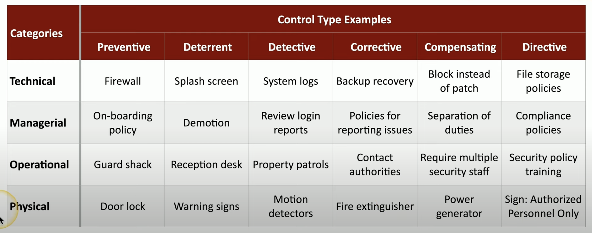

# 1.1 Security Controls and Types 

## Control Categories
- Technical Controls
  - Software or tool that protects your system's CIA:
    - Firewalls
    - Encryption Processes
    - Intrusion Detection Systems

- Managerial Controls
  - aka administrative controls:
    - Security policies
    - SOPs

- Operational Controls
  - controls by people instead of tech:
    - security guards
    - security awareness programs

- Physical Controls
  - guard shacks, badge readers, fences, locks, etc.

---

## Control Types
- Preventive
  - prevent access
  - block access to a resource

- Deterrent 
  - discourage an intrusion attempt
  - make an attacker think twice
  - does not directly prevent access

- Detective
  - identify and log an intrusion attempt
  - finding the issue with system logs, etc.
  - may not prevent access

- Corrective
  - occurs after an event
  - correct the problem
  - reverses the impact of said event

- Compensating
  - security controls through other means
  - this is where existing controls are NOT sufficient
  - EX: required app for a company has a bug noted by developer. set a firewall to exploit said vulnerability

- Directive
  - direct a subject to be security compliant
  - "DO THIS PLEASE!"
  - EX: store all sensitive data in protective folder; train users on security policy

