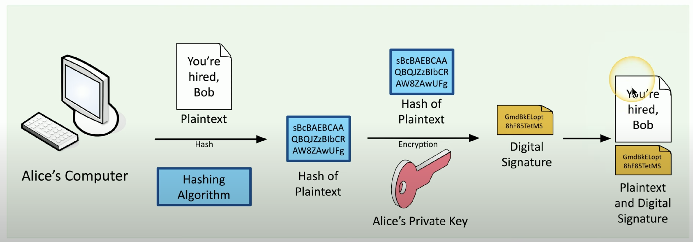
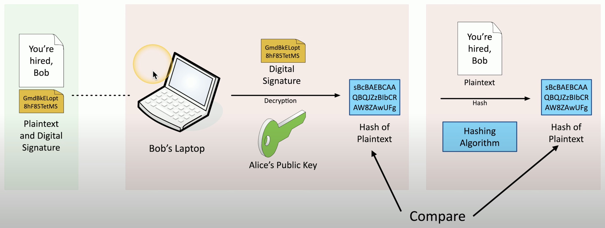
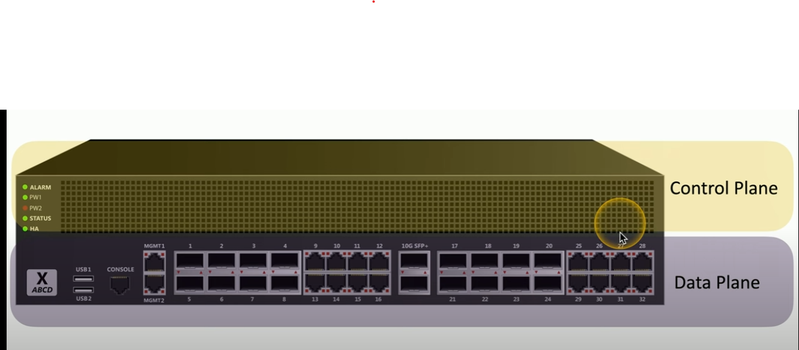
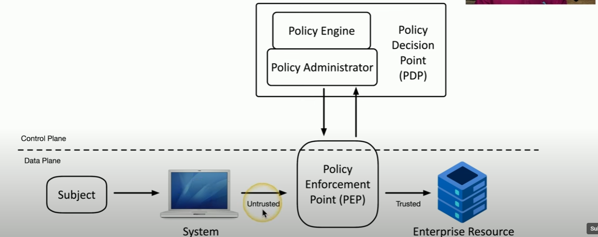

# 1.2 Fundamental Security Concepts

## Confidentiality, Integrity, Availability (CIA or AIC)

- Confidentiality
  - prevent disclosure of info to unauthorized people or systems
  - EX: encryption, access controls, 2FA
- Integrity
  - messages/communication cannot be modified without detection
  - EX: hashing, digital signatures, certificates
  - Non-repudiation
    - meaning it is a proof of integrity - genuine
- Availability
  - systems and network must be up running and working
  - EX: redundancy, fault-tolerance, patching

---

## Non-Repudiation

- EX: Signing a Contract
  - your signatures adds non-repudiation
  - you really signed the contract
  - others can verify you signed the contract
  - this adds: 
    1) proof of integrity, 
    2) proof of origin and authenticity

- **Proof of integrity**
  - this only verifies if data has been changed
  - verify data does not change - data is accurate and consistent
  - this is done by using a HASH
    - EX: message digest, fingerprint
  - if the data changes, the hash changes....like a fingerprint

- **Proof of Origin**
  - this only verifies if the person who sent the data to us
  - EX: authentication, private key, digital signature

---

## Authentication, Authorization, Accounting (AAA)

#### Identification
- This is who you claim to be
- EX: your username

#### Authentication
- prove who you are
- EX: passwords, 2FA, etc.
- authenticate a physical device through 
  - digitally signed certificate
  - VPN from authorized devices
  - management software like Apple MDM
 
**Authentication Systems**
- Certificate Authority
  - CAs manages all of an organizations certificates
  - Organizations creates certificates per device and signs them individually
  - Meaning certificate can be used an auth method to verify it was signed by said org

**Authorization Models**
- Once user is authenticated, we put users in an auth model based on:
  - roles, organizations, etc.
  - think of group policies, AD group
- This will reduce complexity as more users are created

#### Authorization
- Based on Identification and Authentication, what access do you have?
- authorized access based on ID, roles, etc.
- EX: group policies

#### Accounting
- user account logs or reports of access
- EX: login time, logout time, data sent , data received, etc etc.

---

## Gap Analysis
- meaning a gap of where you are vs where you want to be in terms of security
- may take extensive research or study, and weeks or months

**Baseline**
- to start, have a baseline or formal standard for initial goal:
  - NIST Special Publication 800-171 Revision 2
  - ISO/IEC 27001 
- will require baseline of employees:
  - formal training
  - knowledge of security policies and procedures
- examine current security processes, IT systems, policies

**Compare and Contrast**
- evaluate existing systems
- identify weaknesses
- find most effective processes

**Analysis and Report**
- final comparison and report of current security system vs future security
- clarifies a path on how to achieve future goal

---

## Zero Trust
- authenticate or prove yourself each time you access a resource
- everything and everyone must be verified

#### Planes of Operation
- this means that we take our security networks (physical, virtual, cloud) into smaller individual components, thus their own planes

#### Control Plane
- the part of the device that is controls the data plane
- define policies and rules
- EX: firewall rules, routing tables, session tables, NAT tables

**Adaptive Identity**
- where we examine the identity of an individual and apply security controls based on what the user is telling us AND other info from auth process
- consider and confirm the source and the requested resources
  - EX: a user based in USA with an IP address from China
- risk factors:
  - relationship to the organization (employee, contractor, etc.)
  - physical location
  - type of connection
  - IP addresses
- Doing this will create a stronger authentication

**Threat Scope Reduction**
- decrease the number of possible entry points

**Policy-Driven Access Control**
- Once all information is gathered, we can decide what type of authentication process to use to verify a person

**Policy Decision Point**
- uses information from Policy Enforcement Point and makes the decision if the traffic should be allowed or not. Consists of Policy Engine and Policy Administrator
- **Policy Administrator**
  - takes information from Policy Engine back to Policy Decision Point
  - may generate access tokens or credentials
  - tells the Policy Enforcement Point the decision
- **Policy Engine**
  - looks at all requests coming through from Policy Administrator
  - examines each request and compare to a set of security policies
  - makes a decision to grant deny or revoke

#### Data Plane
- the part of the device that is performing the security process
- process the frames, packets, and network data
- processing, forwarding, trunking, encrypting, NAT
- EX: switch, router, firewalls

**Security Zones**
- where we are connecting from and where are we going
- Zones can be:
  - trusted, untrusted
  - internal, external networks
  - VPN 1, VPN 5, etc.
  - Marketing, IT, HR networks
- zones may be enough by itself to deny access
  - EX: user going from untrusted to trusted zone

**Policy Enforcement Point**
- any subjects/users going through the zones will be subject to evaluation by Policy Enforcement Point
- EX: a gatekeeper to allow or disallow traffic
- allow, monitor, and terminate connections
- DOES NOT MAKE ANY DECISIONS. IT WILL GATHER THIS INFORMATION AND SEND TO POLICY DECISION POINT

---

## Physical Security

#### Barricades / Bollards
- prevents access
- channel people through a specific access point

#### Access Control Vestibules
- all doors normally unlocked
  - opening one door causes others to lock
- all doors normally locked
  - unlocking one door prevents others from being unlocked
- one door open / other locked
  - one is always open, other is always locked
- one person/group at a time... controlled groups
  - managed control for this area

#### Fencing
- very obvious
- may not be ideal, but does prevent access
- transparent or opaque
- robust , difficult to cut
- prevents climbing with razor wire or high height

#### Video Surveillance
- CCTV (closed circuit television)
  - can replace physical guards
- camera features:
  - motion recognition can alarm and alert
  - object detection to identify faces, license plates, etc.
- can network and record with multiple cameras

#### Security Guard
- physical protection
- physically validates identification of existing employees
- multiple guards to minimize access

#### Access Badge
- picture, name, role, etc.
- must be worn at all times
- logged when accessing door

#### Lighting
- more light means more security
- attackers avoid light
- infrared cameras see better at dark areas
- avoid shadows and glare

#### Sensors
- Infrared
  - detects infrared radiation in both light and dark
  - EX: motion detectors
- Pressure
  - detects a change in force
  - EX: floor and window sensors
- Microwave
  - detects movement across large areas
- Ultrasonic
  - detects motion, collision detection, etc.
  - sends ultrasonic signals, and receives reflected sound waves

---

## Deception and Disruption

#### Honeypot
- fake environments to attract attackers and trap them
- usually attacker is probably a machine/computer
- honeypots are fake environment to trap attackers fooling that it is a production environment

#### Honeynets
- this is a network honeypots
- may consist of servers, workstations, routers, switches, firewalls, etc.
- goal is to make it more "real" and deceptive to the attacker

#### Honeyfiles
- fake files to attract attackers in honeypot
- bait attackers
- an alert is sent when file is accessed

#### Honeytokens
- traceable data that can be added to the honeynet
- if data is stolen, we know where it came from
- EX: attacker accessing API credentials on cloud share drive which is then alerted to IT