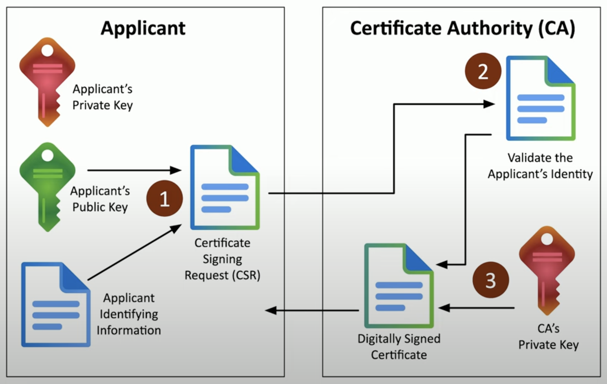

# 1.4 Cryptography

## Public Key Infrastructure (PKI)
- may refer to terms of policies, procedures, hardware, software responsible in creating digital certificates
- also refer to binding a public key to a device
- you might hear the word Certificate Authority

#### Public Key
- can be seen and used by anyone. 
- available to public

#### Private Key
- only one person/device as access to

#### Escrow
- someone holds or manages all your decryption keys

---

## Encryption
- protect data on storage devices (HDD, SDDs, USBs, etc.)

#### Levels

**Full disk/Partition/Volume encryption** 
- encrypt everything
- EX: BitLocker, FileVault

**File encryption** 
- encrypt a single file
- EX: EFS, third-party tools

**Database encryption** 
- Transparent encryption
  - encrypt all database info with a symmetric key
- Record level encryption
  - encrypt individual columns    

#### Transport Encryption
- protect data traversing the network
- EX:  
  - browser using HTTPS (secure encrypted protocol)
  - VPN clients

#### Asymmetric Encryption
- means encrypting with two (or more) keys
- assign one key as public key, the other as private key
- anyone can use the public key encrypt data, BUT only the private key can decrypt that data
- you can't reverse engineer or obtain another private key from a public key
- Key Value Pair:
  - generated from Asymmetric Encryption
  - this is where both the public and private keys are generated simultaneously

#### Symmetric Encryption
- means encrypting with a single shared key
  - encrypt with a key, then decrypt with the same key
- doesn't scale well
  - challenging to distribute and manage to multiple users
- very fast to use
  - less overhead than asymmetric encryption

#### Key Exchange
- How do you share a key across an unsecure medium?
- Out-of-Band Exchange:
  - don't send keys over the network/internet
  - only send keys via telephone, in-person, mailman . etc.
- In-Band Exchange:
  - send key over network
  - protect key with additional encryption
  - use asymmetric encryption for symmetric key

#### Algorithms
- both sides needs to use the same encryption algorithm
- there are pros and cons between each algo because some are more secured, more speed, more complex, etc.

#### Key Length
- larger keys tend to be more secure
  - prevents brute force attacks
- Symmetric Encryption 
  - uses 128-bit or large keys
- Asymmetric Encryption 
  - larger keys than symmetric encryption
  - complex calculations
  - common to see keys of length 3,072 bits or larger

---

## Tools

#### Trusted Platform Module (TPM)
- cryptography on a single hardware device/component like a laptop
- cryptography processor
  - random number generation, key generations
- persistent memory
  - unique keys being burned 
- versatile memory
  - securely store these keys (BitLocker)
- Password protected

#### Hardware Security Module (HSM)
- cryptography on hardware device/component used in larger environments
- securely store thousands of keys
- high-end cryptographic hardware
  - plug-in card or separate hardware 
- cryptography accelerators                                                

#### Key Management System
- central place to manage all of your keys 
- this system will allow us to:
  - associate keys to specific users
  - rotate keys
  - create keys for specific apps
  - key logs

#### Secure Enclave
- separate hardware processor
- keeps data private if device is stolen
- own boot ROM
- real time encryption
- AES encryption 

---

## Obfuscation
- the process of making something clear to something difficult/unclear
- hides info/date in plain sight
- EX: hide info inside an image

#### Steganography
- meaning concealed writing
- security through obscurity:
  - if you know the process that was used to hide the data, you will able to get that data easily
  - not really security at all
- common techniques:
  - network based 
    - embed messages in TCP packets
  - images
    - embed messages within image itself
  - invisible watermarks
  - audio
    - secret messages within the audio
  - video
    - similar to image steganography but larger scale

#### Tokenization
- replace sensitive data with placeholder
- EX: SSN is 123-56-7891 is now 111-22-3344
- common with credit card processing
- this isn't encrypting or hashing

#### Data Masking
- hide some sensitive data like your credit card number
- EX: BankOfAmerica ########7073

---

## Hashing
- represent data as a short string of text
  - a message digest, fingerprint
- One-Way Trip
  - impossible to recover the original message of digest
  - used for passwords / confidential data
- used to verify data matches original document
  - meaning integrity
- can be a digital signature
  - authentication, non-repudiation, integrity

---

## Salting
- random data added to a password when hashed
- all salts are random/unique
- rainbow tables do not work
- slows down brute force attack

---

## Digital Signature
- proves the message was not changed
  - integrity
- proves the source of the message
  - authentication
- makes sure signature isn't fake
  - non-repudiation
- Process:
  1. the person signing the document will use their own private key
  2. recipient using public key to verify

---

## Key Stretching
- to make a weak password stronger and stronger
- this is done by continuing hashing and hashing the password

---

## Blockchain
- a distributed ledger
  - keep track of transactions
- everyone on the blockchain maintains the ledger
  - records and replicates to anyone and everyone
- EX:
  - payment processing
  - digital id

---

## Certifications

#### Digital Certificates
- public key certificate:
  - binds a public key with a digital signature
- A digital signature adds trust
  - PKI uses Certificate Authorities for additional trust
  - Web of Trust adds other users for additional trust
- in a standard format called X.509 format
  - contains certificate details such as serial number, version, issuer, etc.

#### Certificate Authorities (CA)
- how do you know if the website is trusted?
- CA's digitally signed the website certificate
  - you trust the CA, therefore you trust the website
  - real-time verification

#### Certificate revocation lists (CRLs)
- maintained by the CA
- we may want to revoke certificates if web servers are decommissioned or compromises 

#### Online Certificate Status Protocol (OCSP)
- provides scalability for OCSP checks
- we are hvaing the certificate holder verify their own status
- the OCSP status is "staoke"  into the SSL/TLS handshake
- OSCP is usually sent via HTTP
- not all browsers/apps support OSCP

#### Private Certificate Authorities
- built in house
- your devices must trust the internal CA
- needed for medium-to-large orgs
- mostly for web servers and privacy requirements
- EX: Windows Certificate Services, OpenCA

#### Self-Signed Certificates
- internal certificates don't need to be signed by a public CA
  - because your company/ internal users are the only one going to use it
- our internal CAs allow us to sign our own certificates
- if you install your internal CA certificate on all your devices
  - then all devices will trust any certificates signed by that CA

#### Third-Party Certificates
- built into any web browser
- a website can purchase any certificate thats been approved from CAs so that it will be trusted by everyone's web browser that uses that CA
- the CA is responsible for vetting the request

#### Root of Trust
- everything of IT requires trust
- We need someone or something trustworthy to provide their approval
- Root of Trust can be:
  - an inherently trusted component
  - hardware, software, firmware or other component
  - HSM, security enclave, CAs, etc.

#### Certificate Signing Request (CSR)
-  EX: we create a certifcate for our web server, send it over to the CA to be validated, then digitally sign it and finally send it back to us.
  - 
  - We create a key pair, then send the public key to the CA to be signed
  - the CA validates the request  
    - confirms DNS emails and website ownership
  
#### Wildcard Certificates
- aka Subject Alternative Name (SAN)
- it is an extension of the X.509 certificate
- lists additional identification information
- allows a certificate to support many different domains
- Wildcard domains
  - certificates based on the name of the server
  - will apply to all server names in a domain
  - EX:
    - certificate's DNS name is *.birdfeeder.com
      - trust will apply to myname.birdfeeder.com, mail.birdfeeder.com, etc.etc.