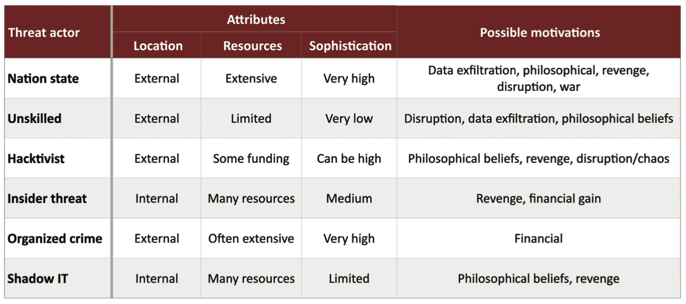

# 1.1 Security Controls and Types 

## Threat Actors
- an entity responsible for an event that has impact on the safety of another entity
- AKA malicious actor

#### Nation-State
- external entity like government and national security
- possible motivations:
  - Data exfiltration, philosophical, revenge, disruption, war
- Constant attacks, massive resources
  - Commonly an Advanced Persistent Threat (APT)
- Highest sophistication
  - Military control, utilities, financial control

#### Unskilled Attacker
- Runs pre-made scripts without any knowledge of what’s really happening
- Motivated by the hunt
- Usually external
- Not sophisticated

#### Hacktivist
- hacker with a purpose
 - Motivated by philosophy, revenge, disruption, etc.
- Usually external
- Can be remarkably sophisticated
  - Very specific hacks
  - DoS, web site defacing, private document release

#### Insider Threat
- Motivated by revenge, financial gain
- Extensive resources
  - Using the organization’s resources against themselves
- Internal
- Medium level of sophistication
  - The insider has institutional knowledge
  - Attacks can be directed at vulnerable systems – The insider knows what to hit

#### Organized Crime
- Professional criminals
  - Motivated by money
- Almost always an external entity
- Very sophisticated
  - Best hacking money can buy
- Crime that’s organized
  - One person hacks, one person manages the exploits,
  another person sells the data, another handles customer support
- Lots of capital to fund hacking efforts

#### Shadow IT
- Going rogue
  - Working around the internal IT organization 
  - Builds their own infrastructure
- Information Technology can put up roadblocks 
  - Shadow IT is unencumbered
  - Use the cloud
  - Might also be able to innovate
- Limited resources 
  - Company budget
- Medium sophistication
  - May not have IT training or knowledge

