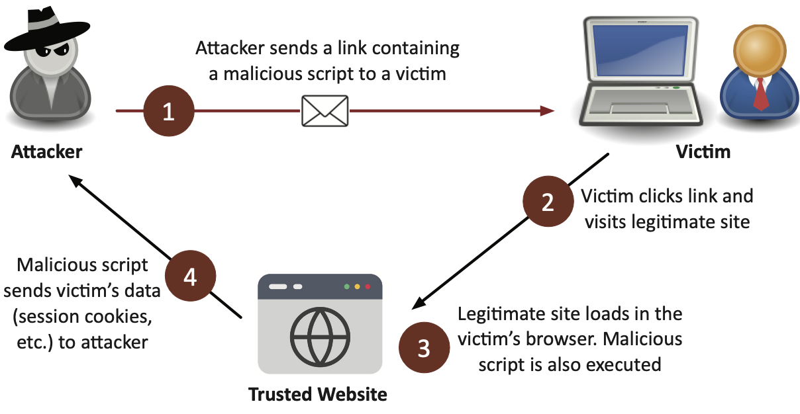

# 2.3 Vulnerabilities Types

- Malware runs in memory
- Memory contains running processes 
  - DLLs (Dynamic Link Libraries)
  - Threads
  - Buffers
  - Memory management functions
- Malware is hidden somewhere
  - Malware runs in its own process
  - Malware injects itself into a legitimate process

## Application

#### Memory Injection
- Add code into the memory of an existing process 
  - Hide malware inside of the process
- Get access to the data in that process 
  - And the same rights and permissions 
  - Perform a privilege escalation

#### Buffer overflow
- Overwriting a buffer of memory
  - Spills over into other memory areas
- Not a simple exploit
  - Takes time to avoid crashing things
  - Takes time to make it do what you want

#### Race Conditions
- Occurs when multiple processes or threads access shared resources concurrently, leading to unpredictable outcomes.
- Happens due to lack of synchronization between processes, potentially causing data corruption or errors.
- Can be exploited by attackers for privilege escalation or bypassing security checks.
##### Time-Of-Check to Time-Of-Use Attack (TOCTOU)
  - Exploits the gap between checking a condition (time-of-check) and using the result (time-of-use).
  - Attackers can alter the state of a resource between the check and its use, causing security vulnerabilities.

#### Malicious Update
- always verify and confirm update of an application is legit
- always download from developer's site directly

---

## Operating system (OS)-based
- Everyone has an operating system 
- This makes the OS a very big target
- Millions lines of code
  - More code means more opportunities for a security issue
  - vulnerabilities are already in there
- Always update

---

## Web-based

#### Structured Query Language Injection (SQLi)
- Where attackers insert malicious SQL code into input fields to manipulate or access a database. 
- Can lead to unauthorized data access, data modification, or complete database compromise.

#### Cross-site scripting (XSS)
- One of the most common web app vulnerabilities 
  - Takes advantage of the trust a user has for a site
- Prevention:
  - Be careful when clicking untrusted links
  - Consider disabling JavaScript
  - Keep your browser and applications updated
  - Validate input
    - Don’t allow users to add their own scripts
    to an input field

##### Non-persistent (reflected) XSS attack
- Occurs when malicious scripts are injected into a web request and immediately reflected back in the server's response.
- Attacker uses credentials/session IDs/cookies to steal victim’s information without their knowledge
- EX: Forms, Links, Search boxes, etc.

##### Persistent (stored) XSS attack
- Occurs when malicious scripts are permanently stored on a target server (e.g., in a database) and executed whenever a user accesses the infected data.

---

## Hardware
- We are surrounded by hardware devices
- Everything is connecting to the network
  - Light bulbs, garage doors, refrigerators, door locks 
  - IoT is everywhere

#### Firmware
- The software (OS) inside of the hardware
- Vendors are the only ones who can fix their hardware

#### End-of-Life (EOL)
- Manufacturer stops selling a product
- May continue supporting the product
  - Important for security patches and updates

##### End-of-Service-Life (EOSL)
- Manufacturer stops selling a product
  - Support is no longer available for the product 
  - No ongoing security patches or updates

#### Legacy
- Older operating systems, applications, middleware
- May be running end-of-life software

---

## Virtualization
- Virtualization vulnerabilities 
  - Local privilege escalations 
  - Command injection
  - Information disclosure

#### Virtual Machine (VM) Escape
- This is where the attacker break out of the VM and interact with the host operating system or hardware
- Once you escape the VM, you have great control.
  - You can control the host and control other guest VMs

#### Resource Reuse
- The ability of a VMs hypervisor to allocate, distribute and manage the resources shared between all of the systems. 
  - efficient allocation of data, performance, etc. as you can have one powerful system instead of multiple cheaper units, that in the end costs more than using a VM system

---

## Cloud-specific 
- Cloud adoption is nearly universal
- Types of Cloud Attacks:
  - Denial of Service (DoS)
  - Authentication bypass
    - take advantage of weak or faulty authentication
  - Directory traversal
  - Remote code execution
  - Cross-site scripting (XSS)
  - SQL injection

---

## Supply Chain

#### Service Provider
- 

#### Hardware Provider
-

#### Software Provider
- 