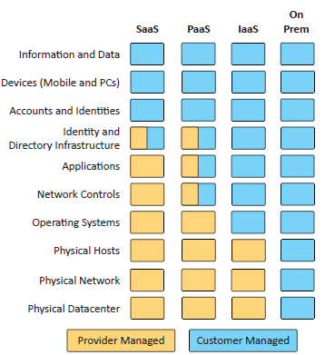

# 3.1 Security Architecture Models

## Architecture and Infrastructure Concepts

#### Cloud

##### Responsibility Matrix:
- 

##### Hybrid Considerations
- infra that is mix with on prem and cloud
- potential issues:
  - increased complexity
  - network protection mismatches
  - different security monitoring
  - data leakage

##### Third Party Vendors
- these vendors are from third-party apps that you bring over to the cloud
- such as third-party firewall for an app you bring to the cloud
- you will need to third-party impact for any incident response
  - this requires constant monitoring

#### Infrastructure as code (IaC)
- Describe an infrastructure
  - Define servers, network, and applications as code
- This automates the setup, configuration, and management of IT infrastructure.
- Configurations are stored in version control systems to track changes
- EX: Terraform, Ansible, and AWS CloudFormation.

#### Serverless
- Function as a Service (FaaS)
  - Apps are separated into individual, autonomous functions
  - Remove the operating system from the equation
- Cloud provider manages the infrastructure so that developers focus only on code
- EX: AWS Lambda, Azure Functions, Google Cloud Functions.

#### Microservices
- Monolithic applications
  - One big application that does everything
- Application contains all decision making processes
  - User interface, business logic, data input and output

#### Network Infrastructure

##### Physical isolation
- Devices that are physically separated
- these are air gapped
- they must be connected directly or via switch to provide communication

##### Logical Segmentation
- dividing a network into distinct segments or groups using software configurations rather than physical separation
- EX: VLANS

##### Software-defined Networking (SDN)
- Split networking devices into different planes:
  - Data, control, and management planes
- Infrastructure layer / Data plane
  - Process the network frames and packets
  - Forwarding, trunking, encrypting, NAT
- Control layer / Control plane
  - Manages the actions of the data plane
  - Routing tables, session tables, NAT tables
  - Dynamic routing protocol updates
- Application layer / Management plane
  - Configure and manage the device
  - SSH, browser, API

#### On-Premises
- infrastructure is on site
- security burden on the client
  - Data center security and infrastructure costs
- on-site security team can physically manage security better
  - but will be expensive
- on-site IT team will maintain uptime and availability
- any security changes will take time
  - new physical equipment, configurations, and additional costs

#### Centralized vs. Decentralized
- Centralized:
  - Pros:
    - single point of security management / easier to manage
    - cost effective / few resources
  - Cons:
    - single point of failure / if this fails, everything will
- Decentralized:
  - Pros:
    - Most organizations are physically decentralized
      - Many locations, cloud providers, operating systems
       Easier to scale
  - Cons:
    - Difficult to manage and protect so many diverse systems
    - More complex

#### Containerization
- Contains everything you need to run an application
- Code and dependencies
- A standardized unit of software

#### Virtualization
- Run many different operating systems on the same hardware
- Each application instance has its own operating system

#### Internet of Things (IoT)
- sensors, doorbells, watches, health monitors, etc.

#### Industrial Control Systems (ICS) / Supervisory Control and Data Acquisition (SCADA)
- Industrial Control Systems (ICS)
  - A system used to control industrial processes (e.g., manufacturing, energy, water treatment).
- Supervisory Control and Data Acquisition (SCADA)
  - A subset of ICS focused on high-level process monitoring and control across large geographical areas.
- ICS refers broadly to industrial automation, while SCADA focuses on monitoring and control over large areas.

#### Real-Time Operating System (RTOS)
- operating system with a deterministic processing schedule
  - No time to wait for other processes
  - Industrial equipment, automobiles,
  - Military environments

#### Embedded Systems
- Hardware and software designed for a specific function
  - Or to operate as part of a larger system
- Built with only this task in mind
- Common examples:
  - Traffic light controllers
  - Digital watches
  - Medical imaging systems 

#### High Availability
- Always on, always available
- Redundancy doesn’t always mean always available
  - system may need to be powered on

---

## Considerations

#### Availability
- System uptime
- Available, but only to the right people
- spend a lot of time and money on availability
  - Monitoring, redundant systems

#### Resilience
- Can you maintain availability?
- Can you recover? How quickly?
- Based on many different variables:
  - The root cause
  - Replacement hardware installation
  - Software patch availability
  - Redundant systems
- Mean Time to Repair (MTTR)

#### Cost
- Everything ultimately comes down to cost
- Ongoing maintenance
  - Annual ongoing cost
- Replacement or repair costs
- Tax implications
  - Operating or capital expense

#### Responsiveness
- How fast your app to get a response
- important for interactive applications
  - Humans are sensitive to delays
- cant have slow apps

#### Scalability
- How quickly and easily can we increase or
decrease capacity?
- Elasticity

#### Ease of Deployment
- An application has many moving parts
  - Web server, database, caching server, firewall, etc.
- Also include:
  - Hardware resources, cloud budgets, change control

#### Risk Transference
- Transfer the risk to a third-party
- Cybersecurity insurance
  - Attacks and downtime can be covered
  - Popular with the rise in ransomware
- Recover internal losses
- Protect against legal issues from customers

#### Ease of Recovery
- How easily can you recover? Time is money.
- let's say we have a malware infection, then:
  - Reload operating system from original media - 1 hour
  - Reload from corporate image - 10 minutes

#### Patch Availability
- always run the latest version
- monthly updates/patches, zero-day patches, etc.

#### Inability to Patch
- Patching may not be an option
- Embedded systems:
  - HVAC controls
  - Time clocks
- May need additional security controls
  - A firewall for your time clock

#### Power
- foundational element and may need more than one resource
- Backup services:
  - UPS (Uninterruptible Power Supply)
  - Generators

#### Compute
- application's power
- Use multiple CPUs across multiple clouds
  - Additional complexity
  - Enhanced scalability